```{r setup, include=FALSE}
options(htmltools.dir.version = FALSE)
knitr::opts_chunk$set(echo = FALSE)
library(tidyverse)
library(here)
library(data.table)
# xaringanExtra::use_fit_screen()

```


# Выборка объектов. 1

.pull-left[

* Из каталога источников годового обзора ART-XC им. Павлинского 12 декабря 2019 -- 15 декабря 2020 (Павлинский и др. 2021)

* S/N > 4.82 для 4—12 кэВ

* 867 всего, 116 открытых ART-XC, ожидается ~ 80 ложных

* Была произведена корреляци с:
    * другими рентгеновскими каталоги
    * предварительным каталогом источников eROSITA на (0 < | $l$ | < 180 $^o$) в ходе первых трех обзоров всего неба
    * каталогами в ИК, оптическом и радио диапазонах
]

---

# Выборка объектов. 2

.pull-left[

цель создать полную выборку по АЯГ КП и др

отбирались для оптической программы новые рентгенвоские источники и ранее изветстные которые не были классифицированы


не всего отобрано а только для этой статьи

* Всего было отобрано 17 источников:
    * 9 на северном небе ( $\delta>-20^o$ )
    * 8 на южном небе
    
* Для 8 источников северного неба мы построили рентгеновские спектры по данным eROSITA и ART-XC в диапазоне 0.2—20 кэВ

]

--

.pull-right[

Отождествление активных ядер галактик

```{r,  fig.align="center"}
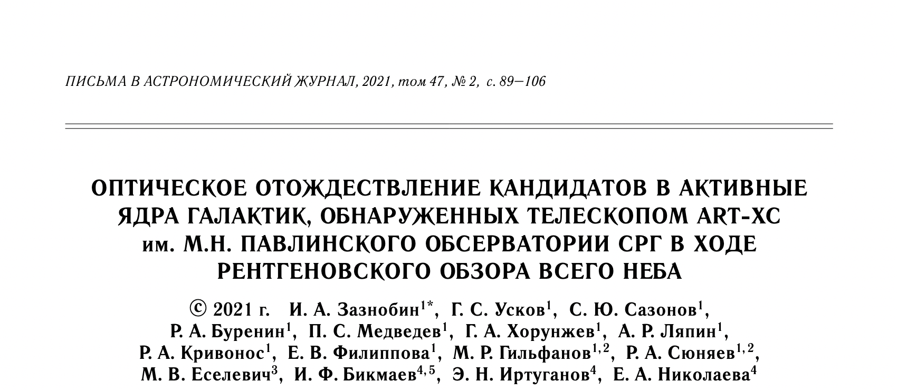
```


Новые катаклизмические переменные

```{r}
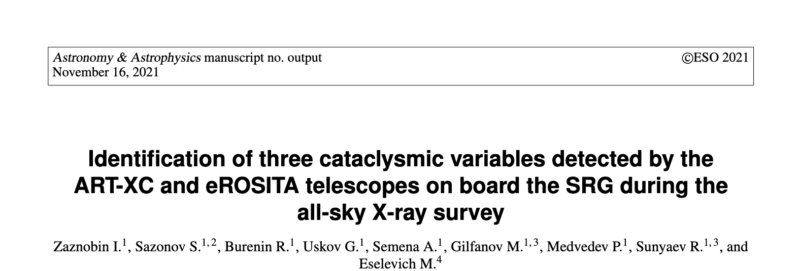
```
]

---

class: center

# Выборка объектов. 3


```{r, out.width="80%"}
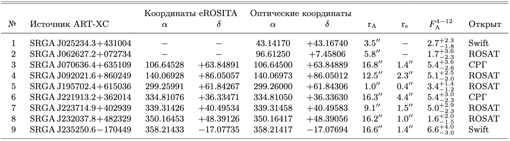
```


```{r, out.width="80%"}
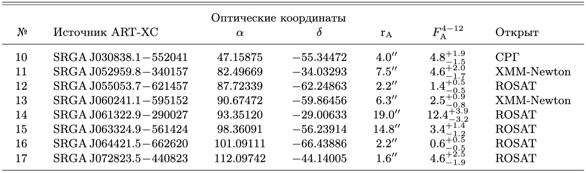
```

---

# Оптические наблюдения

.pull-left[

* Оптическая поддержка:
    * АЗТ-33ИК, ИСЗФ СО РАН. АДАМ (САО РАН, Афанасьев и др. 2016)
    * РТТ-150, обсерватория ТУБИТАК. TFOSC
    
* Наблюдатели:
    * Игорь Зазнобин
    * Александр Ляпин
    * Георгий Хорунжев

* Журнал оптических наблюдений:

```{r}
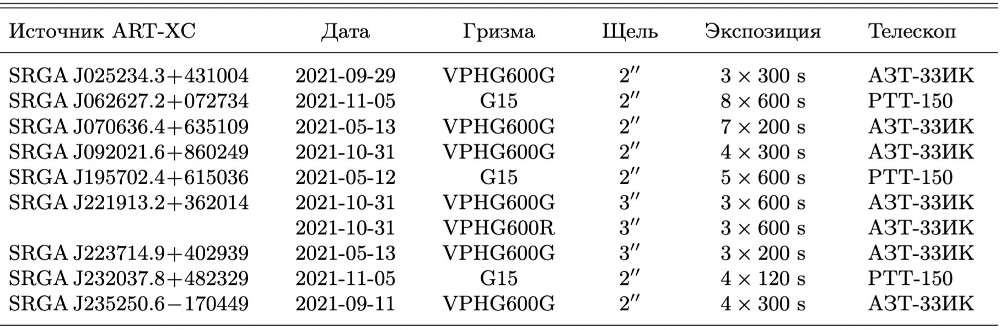
```

]


.pull-right[

```{r, out.width = "160px", fig.align="center", fig.show='hold'}
knitr::include_graphics(c('images/azt33ik.png', 'images/rtt150.jpg'))
```

Сверху: АЗТ-33ИК; снизу: РТТ-150
]
---

# SRGA J025234.3+431004 Sy2

рассказать про рентгеновские спектры, доп компоненту

.pull-left[

```{r}
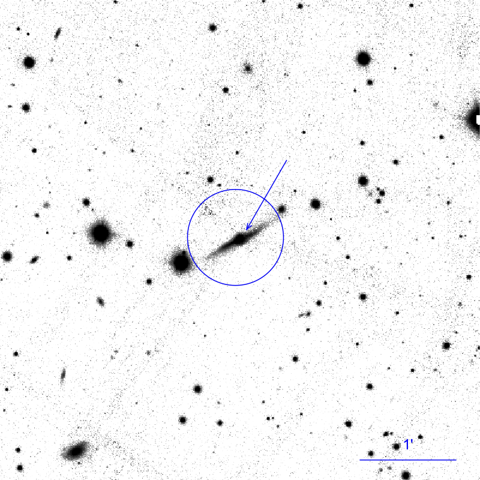
```

]

.pull-right[

```{r}
magick::image_read_pdf("images/j0252_spec.pdf")
```
]

---

# SRGA J025234.3+431004 Sy2

рассказать про рентгеновские спектры, доп компоненту

.pull-left[

```{r}

```

]

.pull-right[

```{r}
magick::image_read_pdf("images/j0252_spec_xray.pdf")
```
]


---

# SRGA J221913.2+362014 Sy2

.pull-left[

```{r}
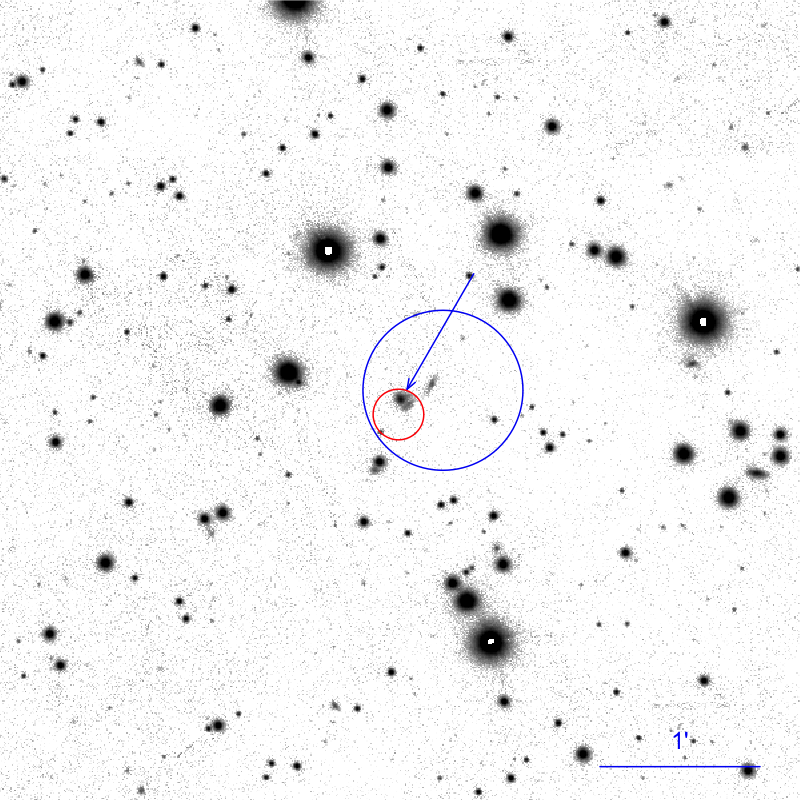
```

]

.pull-right[

```{r, fig.show='hold', fig.cap="G,R", fig.align='center', out.width="300px"}
knitr::include_graphics(c("images/j2219G_spec.png", "images/j2219R_spec.png"))
```
]

---

# SRGA J221913.2+362014 Sy2

.pull-left[
```{r}

```
]

.pull-right[
```{r}
magick::image_read_pdf("images/j2219_spec_xray.pdf")
```
]

---

# SRGA J235250.6-170449 Sy1

.pull-left[


```{r}
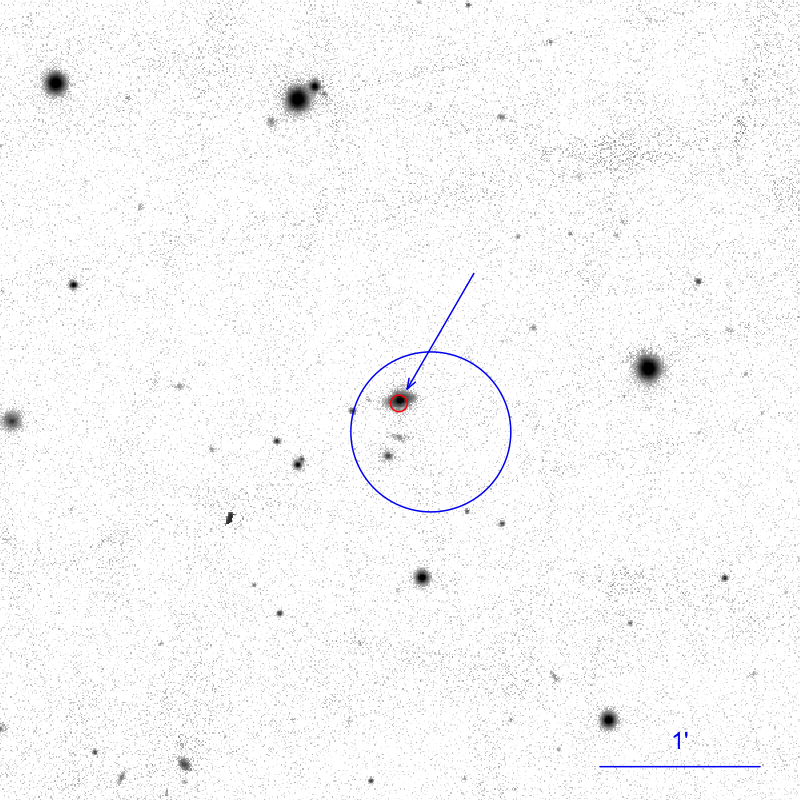
```


]

.pull-right[

```{r}
magick::image_read_pdf("images/j2352_spec.pdf")
```

]

---

# SRGA J235250.6-170449 Sy1

.pull-left[


```{r}

```


]

.pull-right[


```{r}
magick::image_read_pdf("images/j2352_spec_xray.pdf")
```

]

---

# Свойства активных ядер галактик

.pull-left[

Спектры получены на АЗТ-33ИК и РТТ-150

```{r, out.height="80%"}
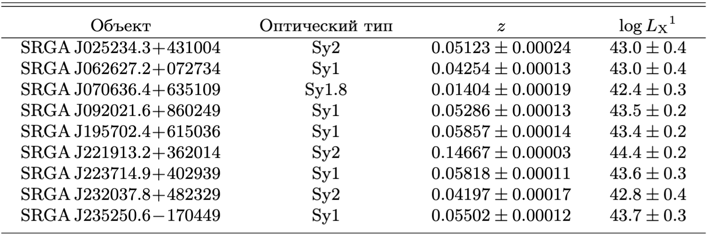
```

Спектры из обзора 6dF

```{r, out.height="80%"}
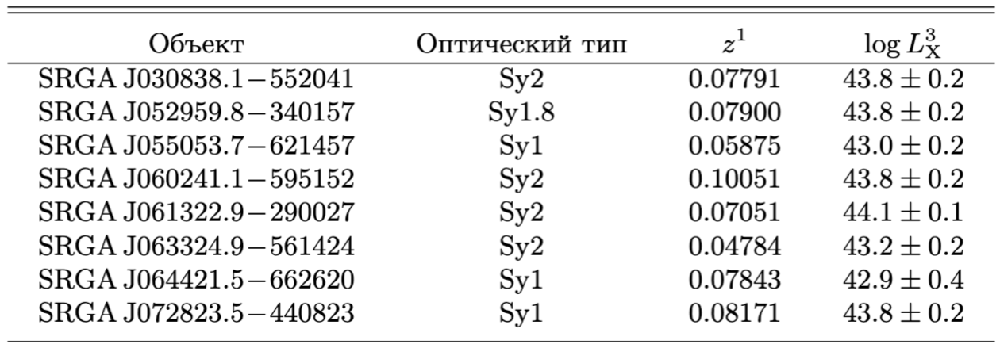
```


]


.pull-right[
```{r, echo=F, out.width="80%", fig.cap="Расположение исследуемых АЯГ на BPT-диаграмме (Балдвин и др., 1981). На графике представлены доверительные интервалы отношений потоков. Стрелкой указаны нижние 2-  $\\sigma$ пределы."}

p_bpt <- readRDS('bpt.Rds') 

p_bpt + 
  # labs(title = 'BPT-диаграмма') + 
  theme(legend.text = element_text(family = 'Times', size = 14),
        legend.position = c(0.25, 0.9))
```
]

---

# Рентгеновские свойства

.pull-left[
```{r}
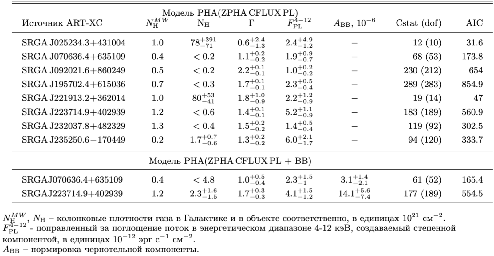
```


]

.pull-right[
```{r, out.width="80%", fig.cap="Зависимость наклона рентгеновского степенного континуума от внутренней колонки поглощения для 8 АЯГ, исследованных по данным телескопов ART-XC и eROSITA. Стрелками показаны 90% верхние пределы."}
p_nh_gamma <- readRDS('nh_vs_gamma.Rds')
p_nh_gamma +
  theme(text = element_text(family = 'Times', size = 24),
        legend.text = element_text(family = 'Times', size = 16),
        axis.text = element_text(family = 'Times', size = 24),
        axis.ticks = element_line(size=1))
```
]

---


# Заключение

сказать здесь или раньше согласуются друг с другом еро и арт

послежним пунктом - всего за послежний год с помощью оптических наюлюдений было отождествлено n аяг и столько то переменных + работа транзиентов артовских

сильнопоглощенный источник показать nuFnu примерно такая форма на тех слайдах

Можно упосмянуть что один из объектов его видно по самым послежним данным глубого обхора обсерваотррии ИНТЕГРАЛ в поле М81. Наблюдения проводятся с 19 года, руководитель Мереминский ИНТЕГРАЛ ИБИС


* Нам удалось отождествить 17 АЯГ с помощью оптических наблюдений на АЗТ-33ИК и РТТ-150 и архивных данным 6dF

* Все они близкие сейфертовские галатики (8 Sy1, 2 Sy 1.8, 7 Sy2) на $z\approx0 - 0.147$

* Для 8 объектов были построены широкополосные рентгеновские (0.2-20 кэВ) спектры по данным ART-XC и eROSITA обсерватории СРГ

* У двух Sy2 и одного Sy1 выявлено внутреннее поглощение $N_{\rm H}\sim10^{23}$ см $^{-2}$ и $N_{\rm H}\sim10^{22}$ см $^{-2}$

* Задачу по отождествлению новых АЯГ из обзора СРГ/ART-XC можно эффективно решать с помощью оптических телескопов 1.5-м класса. 


